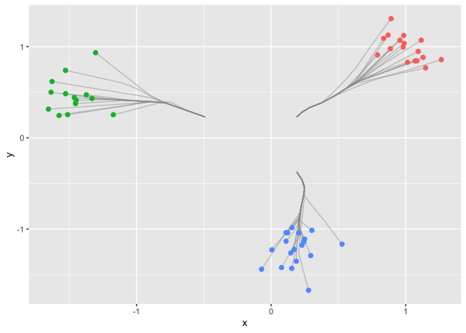

<!-- README.md is generated from README.Rmd. Please edit that file -->

# dpcc

<!-- badges: start -->

<!-- badges: end -->

`dpcc` aims to enable fast computation and path visualization of L1
convex clustering with identical weights.

## Installation

You can install `dpcc` from GitHub with:

``` r
# install.packages("dpcc")
devtools::install_github("bingyuan-zhang/dpcc")
```

Load the packages.

``` r
library(dpcc)
```

## Example

We first generate the three clusters example.

``` r
#install.packages("ggplot2")
library(ggplot2)
set.seed(12)
n = 50
error = matrix(rnorm(n*2,sd = 1.4),n,2)
which=sample(1:3, n, replace=TRUE)
xmean = matrix(rnorm(3*2,sd = 11),3,2)
tb1 = error + xmean[which,]
data = data.frame(
  x = scale(tb1[,1]),
  y = scale(tb1[,2]),
  clusters = factor(which)
)

ggplot(data,aes(x,y,color=factor(clusters))) + 
  geom_point(size = 2, show.legend = FALSE)
```

 Now
we construct a sequence of tuning parameters with length K = 10.

``` r
dat = data.matrix(data)[,1:2]
lam_max = find_lambda(dat)/1.5; 
K = 10
Lam = sapply(1:K, function(i) i/K*lam_max) 

Lam
#>  [1] 0.002726164 0.005452327 0.008178491 0.010904655 0.013630819 0.016356982
#>  [7] 0.019083146 0.021809310 0.024535474 0.027261637
```

Next we use the function in the package to draw the clusterpath.

``` r
res = cpaint(dat,Lam)
df.paths <- data.frame(x = dat[,1],y = dat[,2], group=1:n)
for (j in 1:K) {
  df <- data.frame(x=res[[1]][j,], y=res[[2]][j,], group=1:n)
  df.paths <- rbind(df.paths,df)
}

ggplot(data) + 
  geom_path(data = df.paths, aes(x = x, y = y, group=group), colour='grey60', alpha = 0.5) +
  geom_point(aes(x = x, y = y, col = clusters), size = 2, show.legend = FALSE)
```



## References

\[1.\] \[Dynamic visualization for L1 fusion convex clustering in
near-linear time\] Bingyuan Zhang, Yoshikazu Terada, Jie Chen (UAI 2021
to appear).
